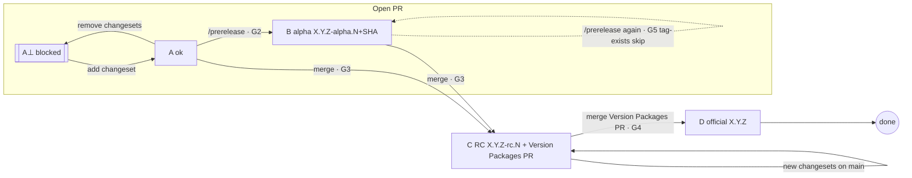

# CI/CD Pipeline — Deterministic Finite Automaton Design

This document is the single source of truth for the release pipeline. Every
workflow in `.github/workflows/` implements one state or transition described
here. Modeled as a **Deterministic Finite Automaton (DFA)**.

## Formal definition

```
DFA = (Q, Σ, δ, q0, F)
```

| Component | Value | Description |
|---|---|---|
| `Q` | `{ A⊥, A, B, C, D }` | States |
| `Σ` | `{ e_fix, e_break, e_prerelease, e_again, e_merge, e_new_changesets, e_releasePR_merged, e_releasePR_unmerged, e_tag_exists }` | Event alphabet |
| `δ` | see transition table | Transition function |
| `q0` | `A⊥` | Initial state (a fresh PR has no changeset until one is added) |
| `F` | `{ D }` | Accepting (terminal) states |

### States

| State | Meaning |
|---|---|
| `A⊥` | Feature/fix PR open — `changeset-required` check FAILING (blocked from merge) |
| `A` | Feature/fix PR open — `changeset-required` check passing |
| `B` | Pre-release(s) (`alpha`) published for an open PR |
| `C` | `main` integrated — release candidate (`rc`) published + "Version Packages" PR open/auto-updated |
| `D` | Official `X.Y.Z` releases published (terminal for one bump cycle) |

### Event alphabet

| Event | Trigger |
|---|---|
| `e_fix` | Commit pushed to PR that adds ≥1 `.changeset/*.md` |
| `e_break` | Commit pushed to PR that removes all `.changeset/*.md` |
| `e_prerelease` | `/prerelease [win11\|linux\|mac]` comment on an open PR (guard G2) |
| `e_again` | Another valid `/prerelease` iteration → single open PR / target version |
| `e_merge` | Feature/fix PR merged into `main` (guard G3) |
| `e_new_changesets` | Push to `main` carrying new changesets (skip self-published commits) |
| `e_releasePR_merged` | "Version Packages" PR merged (guard G4) |
| `e_releasePR_unmerged` | "Version Packages" PR closed without merge |
| `e_tag_exists` | A release tag already exists for the computed version (idempotency, G5) |

## State diagram (Mermaid)

```mermaid
stateDiagram-v2
    direction LR

    [*] --> Aperpend
    Aperpend: A⊥ (PR open, no changeset → blocked)
    A: A (PR open, changeset ok)
    B: B (pre-release alpha published)
    C: C (RC published + Version Packages PR)
    D: D (official X.Y.Z releases published)

    Aperpend --> A: e_fix (add .changeset/*.md)
    A --> Aperpend: e_break (remove all changesets)
    A --> B: e_prerelease (guard G2)
    B --> B: e_again (recompute N; tag-exists → G5 skip)
    B --> C: e_merge (guard G3)
    A --> C: e_merge (guard G3)
    C --> C: e_new_changesets (skip published commits)
    C --> C: e_releasePR_unmerged
    C --> D: e_releasePR_merged (guard G4)
    D --> [*]
```



## Transition table

| # | From | Event / guard | To | Actions (workflow) |
|---|---|---|---|---|
| 1 | `A⊥` | `e_fix`: commit adds ≥1 `.changeset/*.md` (excl. `config.json`, `README.md`, `commit.mjs`) | `A` | `changeset-required.yml` → check passes |
| 2 | `A` | `e_break`: commit removes all changesets | `A⊥` | `changeset-required.yml` → check fails (merge blocked) |
| 3 | `A` | `e_prerelease` + **G2**: PR open ∧ not merged ∧ commenter is PR author or OWNER/MEMBER/COLLABORATOR ∧ `changeset-required` satisfied | `B` | `prerelease.yml` → `publish-release.yml` (`alpha`) |
| 4 | `B` | `e_again`: another valid `/prerelease` (new N, or G5 skip if tag exists) | `B` | `prerelease.yml` (idempotent recompute) |
| 5 | `A` / `B` | `e_merge` + **G3**: PR closed ∧ merged ∧ base `main` ∧ head ≠ `changeset-release/main` | `C` | `release-candidates.yml` (rc.N per affected pkg) ‖ `release.yml` (changesets/action creates/updates "Version Packages" PR) |
| 6 | `C` | `e_new_changesets` + **G3′**: push to `main`, head commit does NOT start with `Version Packages` | `C` | `release-candidates.yml` (rc.N+1) ‖ `release.yml` (action updates PR) |
| 7 | `C` | `e_releasePR_unmerged`: "Version Packages" PR closed, not merged | `C` | no-op; next merge re-creates it |
| 8 | `C` | `e_releasePR_merged` + **G4**: PR merged ∧ base `main` ∧ head `changeset-release/main` ∧ title `Version Packages` | `D` | `publish-official.yml` → `publish-release.yml` (`official`) |
| 9 | any publish | `e_tag_exists` + **G5**: tag `pinax-desktop@<V>` / `pinax-landing@<V>` already exists | — | idempotent skip (every caller + publish step) |

## Guards

| Guard | Rule |
|---|---|
| **G2** | `/prerelease` only: PR open, not merged, commenter authorized, changeset present on head |
| **G3** | Feature/fix merge: `merged == true`, base = `main`, head ≠ `changeset-release/main` |
| **G3′** | Skip commits authored by changesets/action (`head_commit.message` starts with `Version Packages`) |
| **G4** | Official merge: `merged == true`, base = `main`, head = `changeset-release/main`, title = `Version Packages` |
| **G5** | Release tag for the computed version already exists → skip publishing (idempotent) |

## Version scheme

Versions are computed **per package** from `changeset status`. `package.json` is
never bumped by the pipeline itself — only `changesets/action` bumps it (on its
own `changeset-release/main` branch, then merged to `main` via the official PR).

| Kind | Format | Where `X.Y.Z` comes from | Suffix counter |
|---|---|---|---|
| Pre-release (`alpha`) | `X.Y.Z-alpha.N+<sha7>` | `changeset status` on PR head (target next version) | max existing tag `pinax-*@X.Y.Z-alpha.*` → N+1 |
| Release candidate (`rc`) | `X.Y.Z-rc.N` | `changeset status` on merged main | max existing tag `pinax-*@X.Y.Z-rc.*` → N+1 |
| Official | `X.Y.Z` | `package.json` at the "Version Packages" merge commit | — |

Prerelease/RC versions are injected at build time via
`electron-builder --config.extraMetadata.version=<V>` (no file mutation).
Official versions are read directly from the already-bumped `package.json`.

## Release naming and assets

| Package | Release name / tag | Assets |
|---|---|---|
| `@pinax/desktop` | `pinax-desktop@<COMPUTED_VERSION>` | Installers win / mac / linux (AppImage, zip, dmg, Setup.exe) |
| `@pinax/landing` | `pinax-landing@<COMPUTED_VERSION>` | `pinax-landing-<COMPUTED_VERSION>.zip` (compiled Astro output) |

`/prerelease [win11|linux|mac]` scopes the desktop matrix for that build:
`win11` → windows, `linux` → linux, `mac` → both mac archs, omitted → all four.
RC and official builds always use the full matrix.

Every release shipping note includes: the semver bump types (patch/minor/major),
the affected packages, and the computed versions (alpha/rc/semver per case).
Prerelease and RC releases are created with `--prerelease`.

## Workflow ↔ state mapping

| Workflow | Implements |
|---|---|
| `changeset-required.yml` | transitions 1–2 (required check `changeset-required`) |
| `ci.yml` | required check `lint-build` (lint, desktop tsc+vite, landing build) |
| `prerelease.yml` | transitions 3–4 (G2) |
| `release-candidates.yml` | transition 5/6 left half (rc publish, G3/G3′, G5) |
| `release.yml` | transition 5/6 right half (changesets/action → "Version Packages" PR, G3′) |
| `publish-official.yml` | transition 8 (G4, G5) |
| `publish-release.yml` | reusable `workflow_call` — build + assets + `gh release create` for all kinds |

## Branch protection (manual GitHub settings)

`Settings → Branches → main`:

- Require a pull request before merging (blocks direct pushes).
- Require 1 approval. Apply to administrators. Dismiss stale reviews = off.
- Require status checks: `changeset-required`, `lint-build`. "Require branches up
  to date" = **off** (changesets/action keeps the official PR updated itself).
- Do not allow force pushes / deletions.
- Require conversation resolution = on.
- GitHub Pages source = GitHub Actions (for `deploy-landing.yml`).

The `changeset-required` check exempts the "Version Packages" PR by **running and
passing** on `changeset-release/main` — never by skipping (a skipped job does not
satisfy a required status check). Docs-only PRs use `pnpm changeset add --empty`.

## Risks and mitigations

| Risk | Mitigation |
|---|---|
| N-counter race: two PRs targeting the same `X.Y.Z` compute the same N | G5: tag already exists → idempotent skip |
| `+<sha7>` build metadata in electron-builder artifacts | Valid semver; `+` is legal in tag/file names. Verify first Windows alpha; fallback: strip version passed to `extraMetadata`, keep exact tag |
| changesets/action closes PR when changesets vanish / fails with none | `|| true` + early exit on no affected packages; `trap` cleanup of temp status files |
| `macos-26` pinned runner retired | Fail loudly; never fall back to floating `latest` for releases |
| Official tag vs pre-release tags (`pinax-desktop@0.2.0` vs `…@0.2.0-alpha.*`) | Distinct namespaces; G5 skip on pre-existing tags |
| Queued runs reading branch tip | All snapshot checkouts pin exact SHAs (`github.sha`, `merge_commit_sha`, PR head sha) |
| Stale `changeset-status.json` committed at repo root | Removed + gitignored; workflows use temp files |